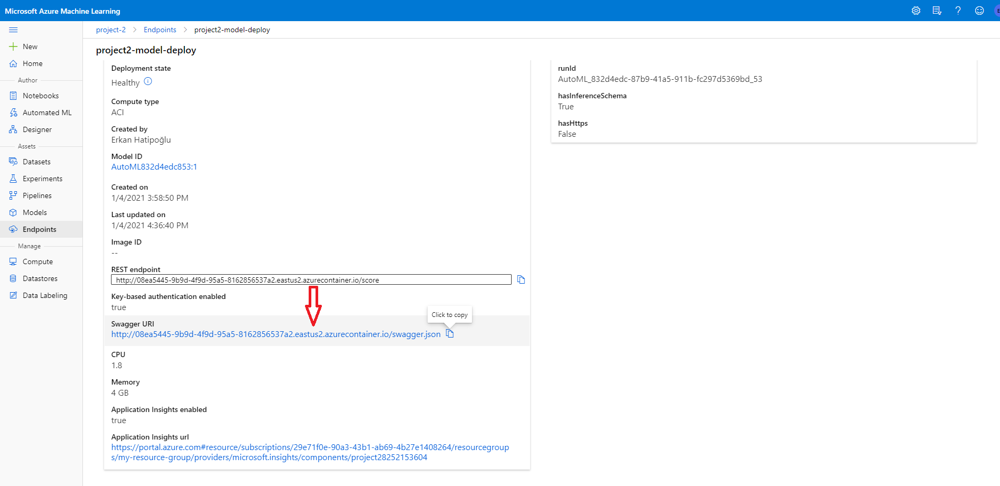

# Operationalizing Machine Learning

In this project, we are working with the Bank Marketing dataset. We use Azure to configure a cloud-based machine learning production model, deploy it, and consume it. We are also creating, publishing, and consuming a pipeline. 

This dataset is about a phone call marketing campaign. The original data can be found [@UC Irvine Machine Learning Repository](https://archive.ics.uci.edu/ml/datasets/bank+marketing). The dataset can be used (as we are using) to predict if the client will subscribe to a term deposit or not. The target variable is y. 

The lab environment provided by Udacity will not be used for this project. Instead, a local development environment along with a Microsoft Azure account will be used. 

## Architectural Diagram

In this project, We are following the below steps:

1. Authentication
2. Automated ML Experiment
3. Deploy the Best Model
4. Enable Logging
5. Swagger Documentation
6. Consume Model Endpoints
7. Create and Publish a Pipeline
8. Documentation


Image by Udacity

## Key Steps
1. Authentication

   Authentication is crucial for the continuous flow of operations. Continuous Integration and Delivery system (CI/CD) rely on uninterrupted flows. When authentication is not set properly, it requires human interaction and thus, the flow is interrupted. An ideal scenario is that the system doesn't stop waiting for a user to input a password. So whenever possible, it's good to use authentication with automation.

   A “Service Principal” is a user role with controlled permissions to access specific resources. Using a service principal is a great way to allow authentication while reducing the scope of permissions, which enhances security.
   
   Main operations in the Authentication step are as follows:
   
      - Use Git Bash to sign in Microsoft account using the `az login` command.
      
      
      
      - Ensure the az command-line tool is installed along with the ml using the `az extension add -n azure-cli-ml` command.
      
      
      
      - Create the Service Principal with az after login in using the `az ad sp create-for-rbac --sdk-auth --name ml-auth` command.
      
      
      
      - Capture the "objectId" using the `clientID`. Use the following command:
      
      ```az ad sp show --id xxxxxxxx-3af0-4065-8e14-xxxxxxxxxxxx```
      
      
      
      - Assign the role to the new Service Principal for the given Workspace, Resource Group, and User `objectId`. You will need to match your workspace, subscription, and ID. There should be no error in the output. Use the following command:
      
      ```az ml workspace share -w xxx -g xxx --user xxxxxxxx-cbdb-4cfd-089f-xxxxxxxxxxxx --role owner```
      
      
      
2. Automated ML Experiment

   In this step, we will create an experiment using Automated ML, configure a compute cluster, and use that cluster to run the experiment. We will use the Bank Marketing dataset described above.
   
   Main operations in the Automated ML Experiment step are as follows:
   
   - Upload the bankmarketing_train.csv to Azure Machine Learning Studio so that it can be used when training the model.
   
   
   
   - Create a new AutoML run and select Bankmarketting Dataset
   
   
   
   - Create a new AutoML experiment
   
   
   
   - Configure a new compute cluster
   
   
   
   - Run the experiment using classification, ensure 'Explain best model' is checked
   
   
   
   
   
   - Wait for the experiment to finish and explore the best model
   
   
   
   
        
   
   
   
   
3. Deploy the Best Model

   Deploying the Best Model will allow to interact with the HTTP API service and interact with the model by sending data over POST requests.
   
   Main operations in Deploy the best model step are as follows:
   
   - Select the best model for deployment
   
   
   
   - Deploy the model and enable Authentication
   
   
   
   - Deploy the model using Azure Container Instance
   
   
   
4. Enable Logging

   We can now enable Application Insights and retrieve logs. Application Insights is a special Azure service that provides key facts about an application. It is a very useful tool to detect anomalies and visualize performance.
   
   Main operations in the Enable Logging step are as follows:
   
   - Download config.json from ML Studio
   
   
   
   - Write and run the code (logs.py) to enable Application insights

   
   
   
   
   - Explore Application insights
   
   
   
5. Swagger Documentation

   In this step, we will consume the deployed model using Swagger. Swagger is a tool that helps build, document, and consume RESTful web services like the ones we are deploying in Azure ML Studio.
   
    Main operations in the Swagger Documentation step are as follows:
    
    - Download the swagger.json file.
    
     Azure provides a swagger.json that is used to create a web site that documents the HTTP endpoint for a deployed model. We can find swagger.json URI in the Endpoints section.
     
     
     
     We need to download the swagger.json to the swagger folder. There should be 3 files in the swagger folder.
     
     
     
     - Run the swagger.sh in git bash.
     
     
     
     - Run the serve.py in another git bash.
     
     
     
     -Interact with the swagger instance running with the documentation for the HTTP API for the model.
     
     To do that we will first use the `http://localhost/` in our browser to interact with the swagger instance running with the documentation for the HTTP API of the model then we will use `http://localhost:8000/swagger.json` to display the contents of the API for the model.
     
     
     
     
     
     
     
6. Consume Model Endpoints
   
   We can consume a deployed service via an HTTP API. An HTTP API is a URL that is exposed over the network so that interaction with a trained model can happen via HTTP requests.

   Users can initiate an input request, usually via an HTTP POST request. HTTP POST is a request method that is used to submit data. The HTTP GET is another commonly used request method. HTTP GET is used to retrieve information from a URL. The allowed request methods and the different URLs exposed by Azure create a bi-directional flow of information.

   The APIs exposed by Azure ML will use JSON (JavaScript Object Notation) to accept data and submit responses. It served as a bridge language among different environments.
   
   Main operations in the Consume Model Endpoints step are as follows:
   
   - Modify both the `scoring_uri` and the `key` (in `endpoint.py`) to match the key for our service and the URI that was generated after deployment.
   
   `scoring_uri` and the `key` can be found on the 'consume' tab of the model endpoint.
   
   
   
   - Run `endpoint.py`
   
   
 
   **Benchmarking**

   A benchmark is used to create a baseline or acceptable performance measure. Benchmarking HTTP APIs is used to find the average response time for a deployed model.

   One of the most significant metrics is the response time since Azure will timeout if the response times are longer than sixty seconds.

   Apache Benchmark is an easy and popular tool for benchmarking HTTP services. 
   
   Main operations in the Benchmarking step are as follows:
   
   - Make sure the Apache Benchmark command-line tool is [installed](https://www.cedric-dumont.com/2017/02/01/install-apache-benchmarking-tool-ab-on-windows/) and available in your path.
   
   - In the `endpoint.py`, replace the key and URI again
   
   - Run `endpoint.py`. A `data.json` file should appear
   
   - Run the `benchmark.sh` file.
   
    
    
    
    
7. Create and Publish a Pipeline

   For this part of the project, we will use the Jupyter Notebook provided in the starter files folder and the Azure portal.
   
   Main operations in the Create and Publish a Pipeline step are as follows:
   
   - Upload the Jupyter Notebook
   
   
   
   - Update all the variables that are noted to match the environment and make sure that a `config.json` has been downloaded and is available in the current working directory.
   
   
   
   - Run through the cells
   
   
   
   Below you can find some important screenshots for this stage:
   
   
   
   
   
   
   
   
   
   
   
   
   
   
   
   
   
   
   
   
   
   
   
   
   
   
   
      
   
## Screen Recording
[Project 2 Operationalizing Machine Learning Screencast](https://youtu.be/6nQsHSIBeCA)

Note: You can refer to `Screencast_text.txt` if you have difficulty understanding screencast audio.

## Future Work

### Improvement for future experiments

The dataset is imbalanced. Although AutoML seems to handle imbalanced data we can try to handle it manually.

TensorFlow LinearClassifier and TensorFlow DNN seem to be blocked since they are not supported by AutML. We can try some HyperDrive runs with these estimators and see their performance.

Deep learning is disabled. We can include Deep learning and run a new AutoML pipeline.

We can select a smaller size of predictors using the feature importance visualizations generated by the model explainability feature of Azure AutoML and run a new AutoML pipeline. By doing this we may get better performance for our model.

We can try new HyperDrive runs with the best performing estimator (VotingEnsemble) to get a better score.

We can monitor the endpoint using Application Insights and detect performance anomalies and visualize performance. We can easily evaluate performance and identify pitfalls since we have already started benchmarking.

## References
- [Machine Learning Engineer for Microsoft Azure](https://www.udacity.com/course/machine-learning-engineer-for-microsoft-azure-nanodegree--nd00333)
